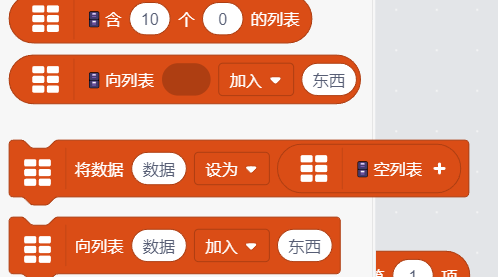

# 在扩展自定义积木

## 前言

有时候扩展提供的注册积木可能没法满足一些999神秘的要求，比如可变参数，在toolbox里面显示一个有子积木的积木，或者自定义field来实现一个代码编辑器，希望999帮助你，这个教程999简单

## 如何在gandi获取scratchBlocks

这个代码是从凌的lpp里的，runtime有很多事件，这些事件被scratch-gui的React组件监听
用事件执行的函数绑定的this获取React组件实列 scratchBlocks，999神秘

```js
const hijack = (fn) => {
    // 这样可以获取监听事件绑定的this，也就是一个React组件实例
    const _orig = Function.prototype.apply
    Function.prototype.apply = (thisArg) => thisArg
    const result = fn()
    Function.prototype.apply = _orig
    return result
}
const getScratch = (runtime) => {
    function getEvent(e) {
        // 获取一个事件
        return e instanceof Array ? e[e.length - 1] : e
    }
    // 监听这个事件的是一个React组件实例，这个实例的props有vm，999好
    const vm = hijack(
        getEvent(runtime._events['QUESTION'])
    ).props.vm
    return {
        // 同样
        scratchBlocks: hijack(
            getEvent(vm._events['EXTENSION_ADDED'])
        )?.ScratchBlocks,
        vm
    }
}
```

## 设置自定义积木初始化

`scratchBlocks.Blocks`就是积木的初始化的代码，所以给他一个proxy之类的，设置的时候改一下
设置的key是`扩展id`+`_`+`你积木的opcode`，然后设置的时候改一下value的init
init 函数里面的 `this` 是 `scratch-blocks\core\block.js` 建议去看一下代码，你就知道能有什么东西可以调用了（在Scratch.extensions.register之前）

```js
scratchBlocks.Blocks = new Proxy(scratchBlocks.Blocks, {
    set(target, property, value) {
        if (property == '你扩展的id' + '_' + '你积木的opcode') {
            const orgInit = value.init
            value.init = function () {
                // 先用原本的 init
                orgInit.call(this)
                // 你要搞的999神秘的事情
            }
        }
        return Reflect.set(target, property, value);
    },
})
```

## 在运行的时候获取 Blockly 积木

有时候想在运行的时候获取正在运行的 Blockly.Block 积木实例，请这样搞：

```js
const workspace = Blockly.getMainWorkspace() // 获取工作区
(args, utils){
    const thread = utils.thread
    // 获取执行积木的id
    const blockId = thread.peekStackFrame()?.op?.id ?? thread.peekStack()
    workspace.getBlockById(BlockId) // Blockly.Block
}
```

## 用XML设置扩展的Toolbox
tw可以直接设置xml，但是gandi不行，不过很好弄只需要加上这些代码（在Scratch.extensions.register之前）


```js
BlockType.XML = 'XML'
const oldConvertForScratchBlocks = runtime._convertForScratchBlocks
runtime._convertForScratchBlocks = function (blockInfo, categoryInfo) {
    if (blockInfo.blockType === BlockType.XML) {
        // 如果是BlockType.XML那就直接返回xml
        return {
            info: blockInfo,
            xml: blockInfo.xml
        };
    } else {
        return oldConvertForScratchBlocks.call(this, blockInfo, categoryInfo)
    }
}
```

使用
```js
{
    blockType: BlockType.XML,
    xml: '<block type="helloworld_hello">' +
        '<value name="DATA">' +
        '<shadow type="text">' +
        '<field name="TEXT">数据</field>' +
        '</shadow>' +
        '</value>' +
        '<value name="VALUE">' +
        '<shadow type="text">' +
        '<field name="TEXT">值</field>' +
        '</shadow>' +
        '<block type="helloworld_empty">' +
        '</value>' +
        '</block>'
}
```

## 自定义field

正在999写，敬请999期待

若有999错误请告诉我，999谢谢你